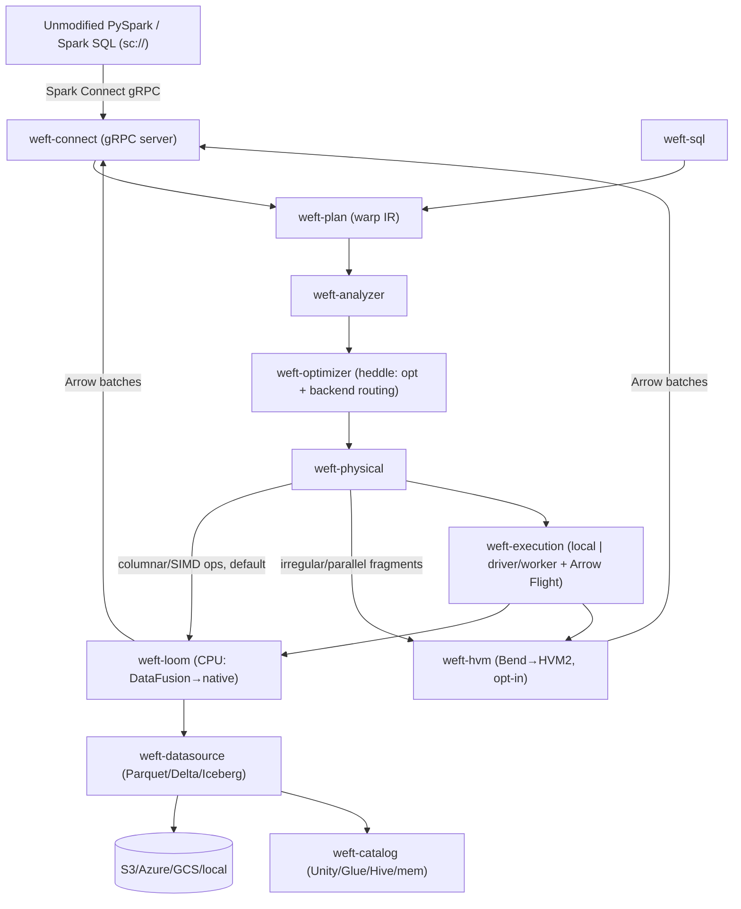

# Weft Architecture

This is the canonical in-repo architecture doc. It condenses the full project plan; when
the two disagree, this file wins for day-to-day engineering.

## Thesis

A drop-in Apache Spark replacement that **beats Sail on CPU** with a lean vectorized core
(**Loom**), and opens a **second front** — HVM2/Bend (**Weft-HVM**) — for the
embarrassingly-parallel, irregular workloads no columnar engine serves well.
*"Weft starts where Sail ends."*

## The decision that shapes everything

The original pitch — "Bend is the execution substrate instead of Rust+DataFusion" —
cannot pass the Phase 1 exit criterion (beat Sail's absolute ClickBench times on CPU).
HVM2 has **no data plane**:

- 24-bit numerics only (`u24/i24/f24`) — a `SUM`/`COUNT` overflows at 16,777,216;
- **no hash-table primitive** (`Map` is an immutable binary tree → path-copying alloc per
  group insert → O(N·log G) *with* allocation);
- **no array/columnar/SIMD type** — a column becomes O(N) boxed cons nodes, pointer-chased;
- 4 GB / 32-bit heap per instance; **no I/O, no FFI** (experimental);
- GPU is **CUDA-only, Nvidia-only, effectively RTX-4090-only**, maintainer-flagged "less
  stable" (`gen-c` is the recommended production target);
- the project has pivoted to Bend2 (AI/proofs); the GPGPU/data pitch is no longer the product.

On ClickBench (pure columnar/SIMD work) HVM2 loses **every** query. So Loom carries the
benchmark; HVM2 is a **gated research bet** for a *different* workload class.

| # | Decision |
|---|----------|
| D1 | **Hybrid engine** — not Bend-purist, not GPU-first |
| D2 | CPU core = **DataFusion now → native heavy-operator carve-out later** |
| D3 | **HVM2 off the critical path**, behind a Phase-2 go/no-go gate |
| D4 | **Rust**; integration surface = **Spark Connect gRPC** |
| D5 | Diverge from Sail on its weak spots: distributed maturity, multi-tenant concurrency, streaming |

## Component graph

**Boundary contract:** everything between operators is Apache Arrow. `weft-hvm` is the only
place data leaves Arrow, and only for coarse routed fragments — never the columnar hot loop.

## How a GROUP BY actually runs

In `weft-loom`: a cache-efficient **radix-partitioned, open-addressing hash table with an
inline hash salt** (DuckDB/DataFusion design), morsel-driven across cores, spilling
partitions independently under memory pressure, with strategy adapted to estimated
cardinality. The *only* thing an interaction net should ever touch is the
embarrassingly-parallel **combine of already-aggregated partials** (small group count,
tree-shaped) — never the per-row probe.

## HVM2 limitations we design around

| Limitation | Plan response |
|---|---|
| 24-bit numerics, no i64/f64 | Never accumulate in Bend; only route small-range compute |
| No hash table | Aggregation/joins stay native; HVM only does the combine step |
| No array/columnar/SIMD | Keep Arrow native; HVM inputs are small structured fragments |
| 4 GB / 32-bit heap | Partition/bound HVM inputs; never hand it a full table |
| No I/O, no FFI | Host (Rust) feeds it; drive HVM2 as a library |
| CUDA/4090-only, "less stable" | GPU is a Phase-2 stretch on fixed dev HW, behind a kill-gate |

## Roadmap (exit criteria)

- **Phase 0** — Spark Connect server + embedded DataFusion; PySpark connects; TPC-H subset
  correct; all 43 ClickBench queries *run* (not yet beating Sail).
- **Phase 1** — native heavy operators + distributed MVP + Delta/Iceberg reads. **Exit: all
  43 ClickBench queries pass AND total hot ≤ Sail's (~56.3 s) on c6a.4xlarge, CPU-only,
  published as an independent ClickBench entry; median speedup vs Spark > 8.4×.**
- **Phase 2** — streaming + Kafka, Unity Catalog, K8s, multi-tenant concurrency; **HVM2
  go/no-go: ≥2× over Loom on a bounded workload class, or shelve as research.**

## Success metric (north star)

Beat Sail's absolute ClickBench total on c6a.4xlarge (CPU-only). The total is dominated by
~10 queries — tie Sail on the cheap 33 (DataFusion parity), beat it 1.5–2× on the expensive
ones.

| Query (1-based) | Class | Sail (s) | Min ×0.9 | Strong ×0.5 | Loom lever |
|---|---|---:|---:|---:|---|
| Q1 `COUNT(*)` | scan/metadata | 0.014 | 0.013 | 0.007 | footer row-count + warm metadata |
| Q7 `MIN/MAX date` | scan/metadata | 0.015 | 0.014 | 0.008 | zone-map short-circuit, instant start |
| Q34 `GROUP BY URL` | high-card agg | 4.91 | 4.42 | 2.46 | adaptive hash-agg |
| Q35 `GROUP BY 1,URL` | high-card agg | 4.96 | 4.46 | 2.48 | adaptive hash-agg + const-fold |
| Q24 `… ORDER BY LIMIT 10` | sort/top-N | 10.2 | 9.18 | 5.10 | late-materialized top-N |
| **Total (hot)** | — | **≈56.3** | **≤56.3** | **≤28.2** | — |

**HVM2 wins 0 of 43 ClickBench queries — by design.** Its moat needs a *separate*
benchmark (recursive/graph UDFs, symbolic transforms, ML-in-query) and must clear the
Phase-2 kill-gate vs cuDF/Velox-GPU.
